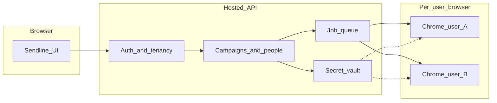
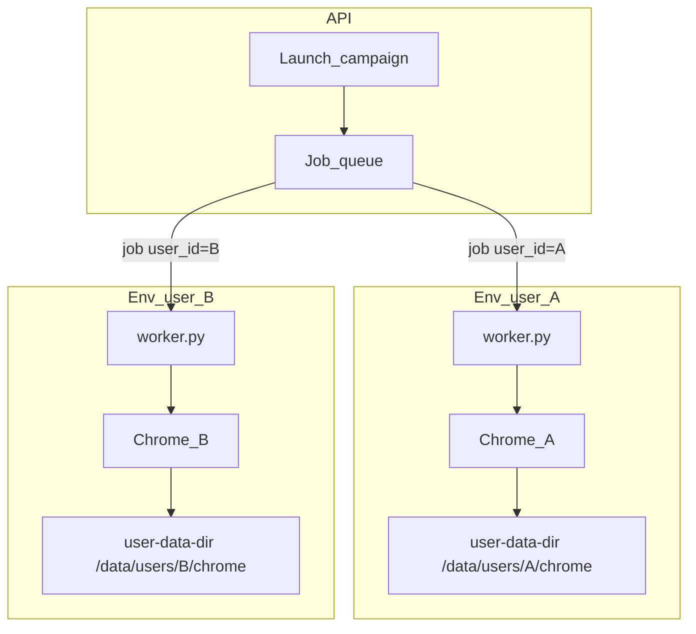

# Multi-user hosting, accounts, and secret isolation

Today Sendline is a **single-operator local app**: one Flask process, one `run_config.json` (including LinkedIn password in plaintext), one Chrome profile, one worker. Hosting that as-is on a public URL would leak every user’s LinkedIn login and customer lists.

You chose:

- **Each Sendline user has their own LinkedIn login** — other users (and ideally admins) cannot see or use it.
- **Fully hosted** — people use Sendline in the browser; Chrome runs in the cloud.

That is a new product, not a small patch on `[app.py](app.py)` / `[worker.py](worker.py)`.

## 1. Two different “accounts”

Keep these separate in the product language and in the database.

- **Sendline user** — email/password or SSO. This is how they log into *your* product. Store only a password **hash** (Argon2id), never the Sendline password itself.
- **LinkedIn login** — belongs to that one Sendline user. Other operators must not list it, decrypt it, or launch a worker with it.

“Assign an account” here means: an admin creates or invites a **Sendline user**; that user then connects **their** LinkedIn login. Do not assign one LinkedIn inbox to many people in v1.

## 2. How to store LinkedIn usernames, passwords, and customer data

Do **not** keep putting secrets in `[run_config.json](run_config.json)` or in a shared disk folder.

| Data                     | Store where                                            | Rule                                                          |
| ------------------------ | ------------------------------------------------------ | ------------------------------------------------------------- |
| Sendline password        | Users table                                            | Hash only (Argon2id)                                          |
| LinkedIn username        | Secrets table, keyed by `user_id`                      | Encrypt at rest                                               |
| LinkedIn password        | Same secrets table, or **do not persist** (see below)  | Encrypt at rest; decrypt only in worker RAM for a few seconds |
| Customer names / lists   | `people` / `campaigns` tables with `user_id`           | Row-level isolation; never a global list                      |
| Attachments              | Private object storage, prefix `users/{user_id}/`      | Signed URLs, no public buckets                                |
| Chrome cookies / profile | Per-user volume, not a shared `chrome_automation_data` | One profile per user                                          |

**LinkedIn password is the dangerous part.** Even encrypted in your DB, a server breach plus KMS access dumps every customer’s LinkedIn login. Prefer this order:

1. **Best:** persist an **encrypted LinkedIn session** (cookies from a successful login), not the password long-term. If the session dies, the user types the LinkedIn password again in Sendline; it is used once, then discarded.
2. **Acceptable v1:** persist LinkedIn password with **envelope encryption** (AWS KMS / GCP KMS / Vault). App never writes plaintext to logs, API responses, or backups.
3. **Not acceptable:** plaintext JSON, env vars shared across workers, or admins able to “view password”.

Also: the API that loads config for the UI must **not** return `linkedin_password`. The current `[GET /api/config](app.py)` would be a direct leak in a multi-user app.

Customer lists: every row tagged `user_id`. Postgres **Row Level Security** so a bug in the app still cannot `SELECT * FROM people`. Encrypt list files at rest if you keep CSV uploads.

## 3. User management (v1)

Minimum that is actually multi-user:

- Sign up / invite: email + password, verify email, optional SSO later.
- Roles: `operator` (own campaigns + own LinkedIn) and `admin` (invite/disable users, see **usage** not LinkedIn passwords or full customer lists unless you explicitly need that).
- Session: HTTPS cookies (httpOnly, Secure, SameSite) or short-lived JWT + refresh.
- Every API call: `current_user.id` is the tenant. Worker jobs include `user_id` and the queue worker may only open that user’s Chrome volume.

Admin “assignment” = invite person, enable/disable them, reset **Sendline** password. Admin cannot impersonate LinkedIn.

## 4. Cloud Chrome workers (the hard part)

One shared Selenium on one VM **does not work**: profiles, cookies, and LinkedIn sessions would mix, and today’s worker still `taskkill`s all Chrome on the machine ([`_kill_chrome()`](worker.py) / `taskkill /F /IM chrome.exe`).

You need **one isolated browser environment per active user**.

### What “isolated” and “active” mean

- **Isolated:** User A’s Chrome process, cookies, debug port, attachments, and logs cannot be seen or killed by User B’s job. Not “two Chrome windows on the same box.”
- **Active:** An environment exists while that user has a run (and optionally a short warm window after). Idle users should not each hold a 24/7 VM.

At most **one run per user** at a time (one LinkedIn profile cannot safely drive two campaigns). Different users may run **in parallel** on different environments.

### Container vs small VM (recommendation)

| | **Linux container** (Docker / ECS Fargate / K8s Job) | **Small VM** (EC2 / GCE / Firecracker microVM) |
|---|---|---|
| Isolation | Process + namespaces. Good if you never publish Chrome’s debug port and never share the host’s Chrome. Weaker against kernel/container escape. | Stronger: own kernel, own IP, own disk. Harder for one tenant to touch another. |
| Chrome profile | Bind-mount encrypted volume at `/data/users/{user_id}/chrome` as `--user-data-dir` | Same idea on a disk unique to that VM |
| Cost / start time | Seconds if the image is warm; cheapest per concurrent run | Minutes unless you keep a warm pool; more £ per idle user |
| Fit for v1 | **Yes**, if each *job* gets its own container and volume, and debug port stays inside the container | Use later if you need a sticky public IP per user or stronger isolation for high-risk tenants |

**Recommend v1: one ephemeral Linux container per run**, with a **persistent encrypted volume per `user_id`**. Do not run many users’ Chromes as processes on one shared VM.

A small VM per *active* user is the right upgrade if LinkedIn bans datacenter IPs aggressively and you need a dedicated egress IP that stays stable across runs.

### Chrome user-data-dir (the actual session)

Today the worker uses a single folder [`chrome_automation_data`](worker.py) (`AUTOMATION_USER_DATA`) plus `--remote-debugging-port=9222` on `127.0.0.1`. That pattern is fine **inside one environment**; it is unsafe if two users share a host.

Per user:

- Path: `/data/users/{user_id}/chrome` (Linux). Never `Profile 7` copied from a human’s laptop.
- Flags: `--user-data-dir=...` `--profile-directory=Default` as now.
- **Do not publish port 9222** to the host or the internet. Selenium must talk to Chrome on `127.0.0.1:9222` *inside the same container*. If 9222 is mapped to the node, any other pod could attach to that LinkedIn session.
- Kill Chrome only **inside that container** (`pkill chrome` / stop the process group). Never host-wide `taskkill` — that is a Windows-single-PC leftover and would destroy other tenants on a shared node.
- The worker today is Windows-oriented (`taskkill`, `chrome.exe` paths). A cloud image is **Linux + Google Chrome**; those process-kill and path helpers must be OS-specific.

Persist the volume so cookies survive between runs. Encrypt the volume (KMS-backed EBS/Persistent Disk, or encrypted disk in the orchestrator). On account deletion, wipe the volume.

### Lifecycle of one environment

1. User clicks Launch. API authorizes `user_id`, writes a job `{user_id, campaign_id}` to the queue. Reject if that user already has a running job.
2. Scheduler starts a container from the Sendline worker image. Mount **only** that user’s Chrome volume and a short-lived secret (campaign payload + LinkedIn session/password decrypted into memory or a tmpfs file, not into a shared env).
3. Container starts Chrome with that user-data-dir, worker attaches, logs stream back over a channel **scoped to that user** (websocket / SSE). Other users cannot subscribe.
4. On Stop or finish: worker closes Chrome, container exits. Volume stays. Optional: keep the container warm 10–15 minutes for a retry without a cold Chrome start.
5. Idle: no container. Next Launch remounts the same volume.

Do **not** recycle a running container onto a different `user_id`. If you use a warm pool of empty containers, attach the volume only after the job is assigned, and discard the container after the run (or after the warm window) so no leftover cookies remain in the overlay filesystem.

### Networking and LinkedIn

- Each environment should have its own network namespace. No path from User B’s worker to User A’s `9222`.
- LinkedIn often flags **shared datacenter NATs**. Many users egressing from one AWS NAT gateway look like one bot farm. Plan (in order of cost): rate limits first; then sticky egress per user (small VM or NAT IP association); residential/proxy networks only with a clear legal/compliance review.
- Automating LinkedIn from cloud IPs increases restriction risk versus the current home-PC Chrome profile. Stakeholders need that in writing.

### What the job is allowed to see

The container gets:

- That user’s campaign (names, message, attachment downloaded to a tmp dir).
- That user’s decrypted LinkedIn secret **in RAM / tmpfs**, wiped on exit.
- That user’s Chrome profile mount.

It must not get: other users’ volumes, the KMS master key, or the app database credentials beyond a narrowly scoped worker role.

Replace [`app.py`](app.py) `Popen(worker.py)` with: enqueue → start **that user’s** environment → stream logs. The Python send loop in [`worker.py`](worker.py) can stay, but Chrome launch/kill/paths become “local to this container.”

## 5. Security baseline for a public URL

- TLS everywhere; bind nothing as raw `127.0.0.1` Flask on the internet.
- CSRF protection, rate limits on login and launch.
- Audit log: who launched, who uploaded a list, who changed LinkedIn connection (not the secret itself).
- Backups encrypted; secrets excluded from app logs (today the worker can print emails — stop printing LinkedIn usernames in shared logs if admins can see all logs).
- Attachments and lists deleted on account deletion.
- 2FA on Sendline accounts (especially anyone who can launch).

## 6. Suggested build order (do not do it all at once)

1. **Auth + tenancy** — Sendline users, sessions, `user_id` on campaigns/people/attachments. Still can run the worker locally per machine if needed.
2. **Secret vault** — LinkedIn credentials out of JSON; UI never round-trips the password after save; show “connected” / “needs login” only.
3. **Per-user cloud browsers** — queue, isolation, encrypted profiles, log streaming per user.
4. **Admin console** — invite, disable, usage. No password viewing.

Current files that cannot stay as the source of truth: `[app.py](app.py)` global `_state` / one `_proc`, `[run_config.json](run_config.json)`, `[worker.py](worker.py)` hardcoded fallbacks and a single `chrome_automation_data` folder.

## What we would not do

- Put the existing Flask app on a public VPS “as multi-user”.
- Let operators share one LinkedIn login (you ruled that out; it also makes audit and bans worse).
- Return or log LinkedIn passwords.
- Run everyone’s Chrome in one browser profile.

